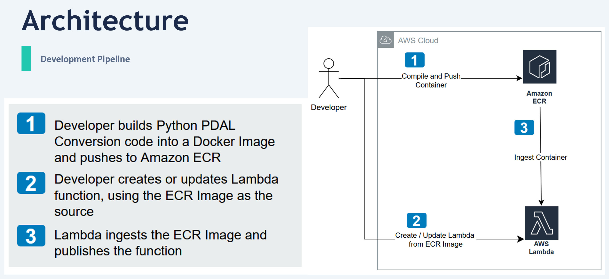
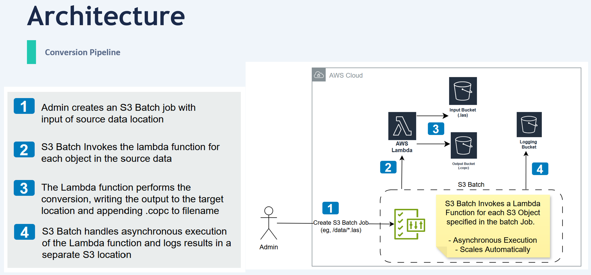
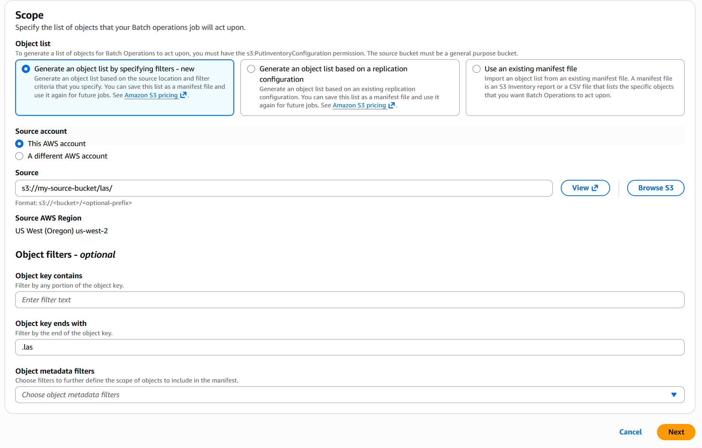
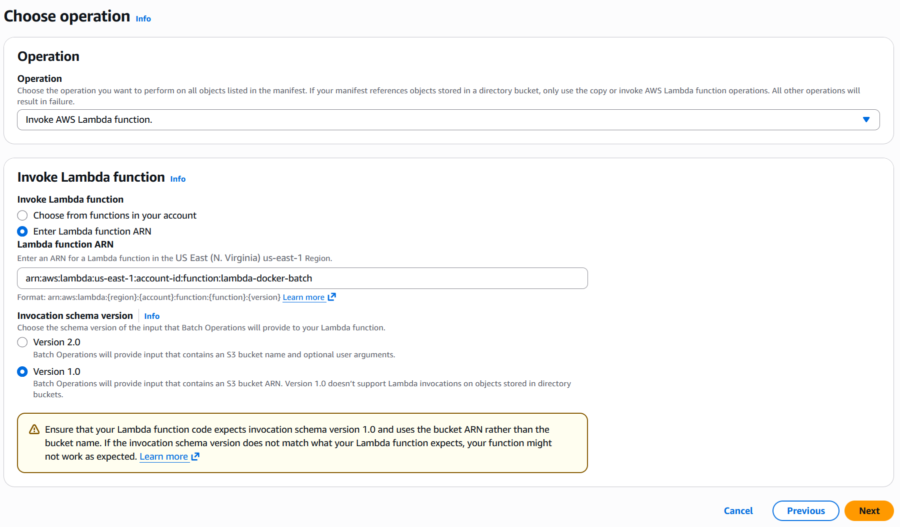
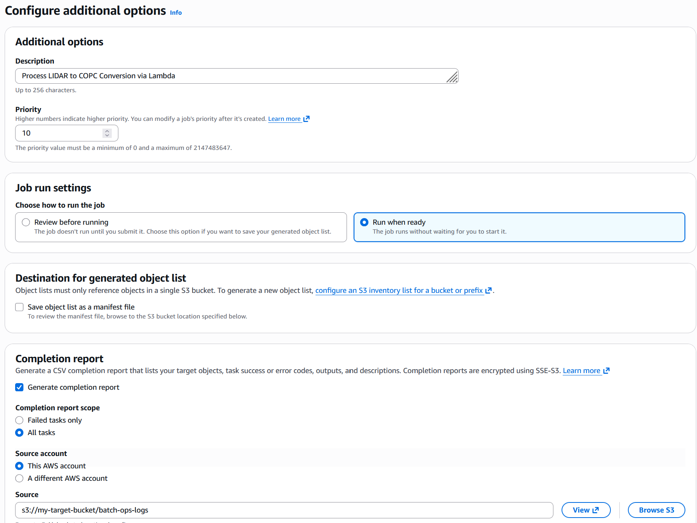

# Converting point data files using AWS serverless

Performs point cloud data conversion using Python PDAL Library executed with a containerized Lambda function via S3 Batch

## TLDR - What does this do

This provides a functional sample architecture for converting [point cloud data](https://en.wikipedia.org/wiki/Point_cloud). More specifically, this [example code](docs/dev-pipeline.png) is converting [LIDAR](https://en.wikipedia.org/wiki/Lidar) (typically stored with _.las_ extensions) to [Cloud Optimized Point Cloud](https://guide.cloudnativegeo.org/copc/) (typically stored with _.las.copc_ extension)

The code itself is very simple. The complexity is in installing the correct components to make this happen and then executing this at scale for thousands to millions of files. The components used in this sample architecture are using [Amazon Web Services](https://aws.amazon.com/).

- [Amazon EC2](https://aws.amazon.com/pm/ec2/): packages the container
- [Amazon ECR](https://aws.amazon.com/ecr/): stores the container
- [AWS Lambda](https://aws.amazon.com/pm/lambda/): configures and executes the container
- [Amazon S3](https://aws.amazon.com/pm/serv-s3/): stores source and target files
- [Amazon S3 Batch Operations](https://aws.amazon.com/s3/features/batch-operations/): executes the conversion function for each source file

## Getting Started

### Development Pipeline

The Development Pipeline will consist of:

1. using/updating the sample code
2. packaging the code into a Docker container
3. pushing the container to ECR
4. creating/updating the Lambda function



#### Installing Pre-requisites

To perform these steps, you can use your own develpment environment. However, the sample scripts below have been tested using an Amazon Linux 2023 instance on EC2. It is recommended to use a t3.medium or larger. These are the pre-requisites:

- Docker
- Python/PIP
- AWS Lambda Runtime Environment (custom base image + Python)
- AWS CLI with proper credentials to access the afore-mentioned AWS services

1. Install Docker

```
sudo dnf update -y
sudo dnf install -y docker
sudo systemctl start docker
sudo systemctl enable docker
sudo usermod -aG docker $USER
newgrp docker
```

2. Install Python/pip/git

```
sudo dnf install python3-pip -y
sudo dnf install -y git
```

3. Install Lambda Runtime Environment

```
sudo dnf install python3-pip -y
pip install awslambdaric
rm -rf ~/.aws-lambda-rie
mkdir -p ~/.aws-lambda-rie
curl -Lo ~/.aws-lambda-rie/aws-lambda-rie \
  https://github.com/aws/aws-lambda-runtime-interface-emulator/releases/latest/download/aws-lambda-rie \
  --fail --show-error --location
chmod 755 ~/.aws-lambda-rie/aws-lambda-rie
```

#### Package the container

1. Pull sample code and edit as needed

```
git clone https://github.com/jahoog/pdal_conversion_s3_batch
cd pdal_conversion_s3_batch/dev
```

2. Build container

```
export LAMBDA_DOCKER_IMAGE_NAME=lambda-docker-batch:test
export LAMBDA_DOCKER_REPO_NAME=lambda-docker-batch
docker buildx build --platform linux/amd64 --provenance=false -t "$LAMBDA_DOCKER_REPO_NAME" .
```

3. Push container to ECR

```
export ECR_REGISTRY={accountId}.dkr.ecr.{region}.amazonaws.com
docker tag "$LAMBDA_DOCKER_IMAGE_NAME" "$ECR_REGISTRY/$LAMBDA_DOCKER_REPO_NAME"
aws ecr get-login-password | docker login --username AWS --password-stdin "$ECR_REGISTRY"
aws ecr create-repository --repository-name "$LAMBDA_DOCKER_REPO_NAME"
docker push "$ECR_REGISTRY/$LAMBDA_DOCKER_REPO_NAME:latest"
```

4. Create/Update Lambda Function Code

**Create**

```
export LAMBDA_IAM_ROLE=arn:aws:iam::{accountid}:role/role-name
export LAMBDA_TIMEOUT=120
export LAMBDA_MEMORY=2048
export LAMBDA_STORAGE=10240
export S3_TARGET_FOLDER={my/s3/folder}
export S3_TARGET_BUCKET={my-bucket-name}
aws lambda create-function \
  --function-name "$LAMBDA_DOCKER_REPO_NAME" \
  --package-type Image \
  --code ImageUri="$ECR_REGISTRY/$LAMBDA_DOCKER_REPO_NAME:latest" \
  --role "$LAMBDA_IAM_ROLE" \
  --timeout "$LAMBDA_TIMEOUT" \
  --memory-size "$LAMBDA_MEMORY" \
  --ephemeral-storage Size="$LAMBDA_STORAGE" \
  --environment Variables='{
    "S3_TARGET_FOLDER":"'$S3_TARGET_FOLDER'",
    "S3_TARGET_BUCKET":"'$S3_TARGET_BUCKET'",
    "HOME":"/tmp"
  }'
```

**Update**

```
aws lambda update-function-code --function-name "$LAMBDA_DOCKER_REPO_NAME" --package-type Image --code ImageUri="$ECR_REGISTRY/$LAMBDA_DOCKER_REPO_NAME:latest" --publish
```

## Conversion Pipeline

Once the lambda function has been published, then you can use Amazon S3 Batch Operations to execute the conversion on your source files.



Step-by-Step for creating a conversion job

1. Navigate to [S3 Batch Operations](https://us-east-1.console.aws.amazon.com/s3/jobs) in the AWS Console.

2. Click **Create Job**

3. In Step 1, select your S3 bucket that contains the files you want to process the conversion for. Include an optional prefix and filters, such as ending in _.las_. Click Next.



4. In Step 2, select **Invoke AWS Lambda Function** for the operation, and then choose or enter the Lambda Function that you created in the Development Pipeline.



5. In Step 3, enter a description and an S3 location for your logs. You'll need to either provide an IAM role that has access to the Lambda function, or allow the process to create one automatically for you.



6. Click **Next** and then **Submit** to run the batch job. You will be able to see progress on the job details page and view the final output once the job is complete.
